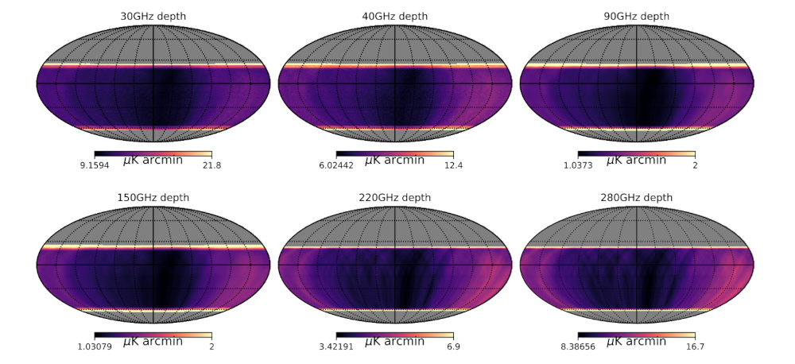

# Data Release: Data Challenge 0 (DC-0)

## Description

CMB-S4 Data Challenges involve the simulation, reduction, and analysis of a mock dataset corresponding to the current point design of the instruments and their observations and is used:

* to validate that the point design meets all of the project’s measurement and science requirements
* to verify that the project pipelines run sufficiently fast on that generation’s computational architecture(s), and scale sufficiently well to the CMB-S4 data volume.

DC-0 is the first execution of a Data Challenge run, it has been completed for Large Aperture Telescopes located in Chile (`CHLAT`) and the Small Aperture Telescopes located in the South Pole (`SPSAT`), the South Pole Large Aperture telescope (`SPLAT`) is still being worked on.

The full documentation of the release will be published publicly. For now, the best reference is the Technical Design to Measurement Requirements Appendix in the [`PBDR draft`](https://github.com/CMB-S4/PreliminaryBaselineDesignReport) in the Github repository, only accessible to members of the CMB-S4 Github organization.

## Data Access

Data access is currently restricted to members of the CMB-S4 Collaboration via a Globus Group.

See the [homepage of the data portal](index.md) for details on how to access and download the data.

## Data Products & Organization

The DC-0 data release includes a single Intensity and Polarization HEALPix map in FITS format for each split and for each frequency channel which includes:

* Galactic foregrounds
* Extragalactic foregrounds
* Cosmic Microwave Background signal
* Atmospheric and instrumental noise

and a second map which includes the map depth for Temperature and for Polarization.
More details about the data products are available in the map FITS headers and in the [Validation of the CMB-S4 Conceptual Design with Data Challenge 0 document (in preparation, currently available only to CMB-S4 members)](https://github.com/CMB-S4/DataChallenge0).

Depth map for temperature for Chilean LAT in Equatorial coordinates.

Data splits are created by simulating each 1-hour long observation independently, then coadding all of them to create the full mission dataset `Split01` and coadding the observation in a round-robin fashion in 2, 4, 8, 16 and 32 independent maps. The full mission data set and 2-way splits are available here.

All other data products (including higher order data splits) are available on the CMB-S4 community filesystem at NERSC at `/global/cfs/cdirs/cmbs4/dc/dc0/mission/`.

## Datasets & Files

Files are grouped into datasets by telescope, time split, and frequency band. Each dataset is contained within a single folder and may contain subfolders. The top-level dataset folder contains a JSON file (`manifest.json`) using the BDBag [remote file manifest
format](https://github.com/fair-research/bdbag/blob/master/doc/config.md#remote-file-manifest) with the checksum, size, and HTTPS URL of each file.

The dataset pages provide a link to the dataset's folder in the Globus web app and links to the the invidual files for immediate download.

|                Link                | Telescope | Split | Frequency Band (GHz) | Number of Files | Total Size |
| ---------------------------------- | --------- | ----- | -------------------- | --------------- | ---------- |
| [Link](dc0-chlat-split01-025.html) | CHLAT     | `01`  | `025`                | `7`             | 17.3 GiB   |
| [Link](dc0-chlat-split01-040.html) | CHLAT     | `01`  | `040`                | `7`             | 17.3 GiB   |
| [Link](dc0-chlat-split01-090.html) | CHLAT     | `01`  | `090`                | `7`             | 17.3 GiB   |
| [Link](dc0-chlat-split01-150.html) | CHLAT     | `01`  | `150`                | `7`             | 17.3 GiB   |
| [Link](dc0-chlat-split01-230.html) | CHLAT     | `01`  | `230`                | `7`             | 17.3 GiB   |
| [Link](dc0-chlat-split01-280.html) | CHLAT     | `01`  | `280`                | `7`             | 17.3 GiB   |
| [Link](dc0-chlat-split02-025.html) | CHLAT     | `02`  | `025`                | `14`            | 34.5 GiB   |
| [Link](dc0-chlat-split02-040.html) | CHLAT     | `02`  | `040`                | `14`            | 34.5 GiB   |
| [Link](dc0-chlat-split02-090.html) | CHLAT     | `02`  | `090`                | `14`            | 34.5 GiB   |
| [Link](dc0-chlat-split02-150.html) | CHLAT     | `02`  | `150`                | `14`            | 34.5 GiB   |
| [Link](dc0-chlat-split02-230.html) | CHLAT     | `02`  | `230`                | `14`            | 34.5 GiB   |
| [Link](dc0-chlat-split02-280.html) | CHLAT     | `02`  | `280`                | `14`            | 34.5 GiB   |
| [Link](dc0-chlat-split04-025.html) | CHLAT     | `04`  | `025`                | `28`            | 69.0 GiB   |
| [Link](dc0-chlat-split04-040.html) | CHLAT     | `04`  | `040`                | `28`            | 69.0 GiB   |
| [Link](dc0-chlat-split04-090.html) | CHLAT     | `04`  | `090`                | `28`            | 69.0 GiB   |
| [Link](dc0-chlat-split04-150.html) | CHLAT     | `04`  | `150`                | `28`            | 69.0 GiB   |
| [Link](dc0-chlat-split04-230.html) | CHLAT     | `04`  | `230`                | `28`            | 69.0 GiB   |
| [Link](dc0-chlat-split04-280.html) | CHLAT     | `04`  | `280`                | `28`            | 69.0 GiB   |
| [Link](dc0-chlat-split08-025.html) | CHLAT     | `08`  | `025`                | `56`            | 138.0 GiB  |
| [Link](dc0-chlat-split08-040.html) | CHLAT     | `08`  | `040`                | `56`            | 138.0 GiB  |
| [Link](dc0-chlat-split08-090.html) | CHLAT     | `08`  | `090`                | `56`            | 138.0 GiB  |
| [Link](dc0-chlat-split08-150.html) | CHLAT     | `08`  | `150`                | `56`            | 138.0 GiB  |
| [Link](dc0-chlat-split08-230.html) | CHLAT     | `08`  | `230`                | `56`            | 138.0 GiB  |
| [Link](dc0-chlat-split08-280.html) | CHLAT     | `08`  | `280`                | `56`            | 138.0 GiB  |
| [Link](dc0-chlat-split16-025.html) | CHLAT     | `16`  | `025`                | `112`           | 276.0 GiB  |
| [Link](dc0-chlat-split16-040.html) | CHLAT     | `16`  | `040`                | `112`           | 276.0 GiB  |
| [Link](dc0-chlat-split16-090.html) | CHLAT     | `16`  | `090`                | `112`           | 276.0 GiB  |
| [Link](dc0-chlat-split16-150.html) | CHLAT     | `16`  | `150`                | `112`           | 276.0 GiB  |
| [Link](dc0-chlat-split16-230.html) | CHLAT     | `16`  | `230`                | `112`           | 276.0 GiB  |
| [Link](dc0-chlat-split16-280.html) | CHLAT     | `16`  | `280`                | `112`           | 276.0 GiB  |
| [Link](dc0-chlat-split32-025.html) | CHLAT     | `32`  | `025`                | `224`           | 552.0 GiB  |
| [Link](dc0-chlat-split32-040.html) | CHLAT     | `32`  | `040`                | `224`           | 552.0 GiB  |
| [Link](dc0-chlat-split32-090.html) | CHLAT     | `32`  | `090`                | `224`           | 552.0 GiB  |
| [Link](dc0-chlat-split32-150.html) | CHLAT     | `32`  | `150`                | `224`           | 552.0 GiB  |
| [Link](dc0-chlat-split32-230.html) | CHLAT     | `32`  | `230`                | `224`           | 552.0 GiB  |
| [Link](dc0-chlat-split32-280.html) | CHLAT     | `32`  | `280`                | `224`           | 552.0 GiB  |
| [Link](dc0-spsat-split01-025.html) | SPSAT     | `01`  | `025`                | `8`             | 23.7 GiB   |
| [Link](dc0-spsat-split01-040.html) | SPSAT     | `01`  | `040`                | `8`             | 25.1 GiB   |
| [Link](dc0-spsat-split01-085.html) | SPSAT     | `01`  | `085`                | `8`             | 29.6 GiB   |
| [Link](dc0-spsat-split01-095.html) | SPSAT     | `01`  | `095`                | `8`             | 30.1 GiB   |
| [Link](dc0-spsat-split01-145.html) | SPSAT     | `01`  | `145`                | `8`             | 29.8 GiB   |
| [Link](dc0-spsat-split01-155.html) | SPSAT     | `01`  | `155`                | `8`             | 30.2 GiB   |
| [Link](dc0-spsat-split01-230.html) | SPSAT     | `01`  | `230`                | `8`             | 31.0 GiB   |
| [Link](dc0-spsat-split01-280.html) | SPSAT     | `01`  | `280`                | `8`             | 31.0 GiB   |
| [Link](dc0-spsat-split02-025.html) | SPSAT     | `02`  | `025`                | `14`            | 552.1 MiB  |
| [Link](dc0-spsat-split02-040.html) | SPSAT     | `02`  | `040`                | `14`            | 552.1 MiB  |
| [Link](dc0-spsat-split02-085.html) | SPSAT     | `02`  | `085`                | `14`            | 552.1 MiB  |
| [Link](dc0-spsat-split02-095.html) | SPSAT     | `02`  | `095`                | `14`            | 552.1 MiB  |
| [Link](dc0-spsat-split02-145.html) | SPSAT     | `02`  | `145`                | `14`            | 552.1 MiB  |
| [Link](dc0-spsat-split02-155.html) | SPSAT     | `02`  | `155`                | `14`            | 552.1 MiB  |
| [Link](dc0-spsat-split02-230.html) | SPSAT     | `02`  | `230`                | `14`            | 552.1 MiB  |
| [Link](dc0-spsat-split02-280.html) | SPSAT     | `02`  | `280`                | `14`            | 552.1 MiB  |
| [Link](dc0-spsat-split04-025.html) | SPSAT     | `04`  | `025`                | `28`            | 1.1 GiB    |
| [Link](dc0-spsat-split04-040.html) | SPSAT     | `04`  | `040`                | `28`            | 1.1 GiB    |
| [Link](dc0-spsat-split04-085.html) | SPSAT     | `04`  | `085`                | `28`            | 1.1 GiB    |
| [Link](dc0-spsat-split04-095.html) | SPSAT     | `04`  | `095`                | `28`            | 1.1 GiB    |
| [Link](dc0-spsat-split04-145.html) | SPSAT     | `04`  | `145`                | `28`            | 1.1 GiB    |
| [Link](dc0-spsat-split04-155.html) | SPSAT     | `04`  | `155`                | `28`            | 1.1 GiB    |
| [Link](dc0-spsat-split04-230.html) | SPSAT     | `04`  | `230`                | `28`            | 1.1 GiB    |
| [Link](dc0-spsat-split04-280.html) | SPSAT     | `04`  | `280`                | `28`            | 1.1 GiB    |
| [Link](dc0-spsat-split08-025.html) | SPSAT     | `08`  | `025`                | `56`            | 2.2 GiB    |
| [Link](dc0-spsat-split08-040.html) | SPSAT     | `08`  | `040`                | `56`            | 2.2 GiB    |
| [Link](dc0-spsat-split08-085.html) | SPSAT     | `08`  | `085`                | `56`            | 2.2 GiB    |
| [Link](dc0-spsat-split08-095.html) | SPSAT     | `08`  | `095`                | `56`            | 2.2 GiB    |
| [Link](dc0-spsat-split08-145.html) | SPSAT     | `08`  | `145`                | `56`            | 2.2 GiB    |
| [Link](dc0-spsat-split08-155.html) | SPSAT     | `08`  | `155`                | `56`            | 2.2 GiB    |
| [Link](dc0-spsat-split08-230.html) | SPSAT     | `08`  | `230`                | `56`            | 2.2 GiB    |
| [Link](dc0-spsat-split08-280.html) | SPSAT     | `08`  | `280`                | `56`            | 2.2 GiB    |
| [Link](dc0-spsat-split16-025.html) | SPSAT     | `16`  | `025`                | `112`           | 4.3 GiB    |
| [Link](dc0-spsat-split16-040.html) | SPSAT     | `16`  | `040`                | `112`           | 4.3 GiB    |
| [Link](dc0-spsat-split16-085.html) | SPSAT     | `16`  | `085`                | `112`           | 4.3 GiB    |
| [Link](dc0-spsat-split16-095.html) | SPSAT     | `16`  | `095`                | `112`           | 4.3 GiB    |
| [Link](dc0-spsat-split16-145.html) | SPSAT     | `16`  | `145`                | `112`           | 4.3 GiB    |
| [Link](dc0-spsat-split16-155.html) | SPSAT     | `16`  | `155`                | `112`           | 4.3 GiB    |
| [Link](dc0-spsat-split16-230.html) | SPSAT     | `16`  | `230`                | `112`           | 4.3 GiB    |
| [Link](dc0-spsat-split16-280.html) | SPSAT     | `16`  | `280`                | `112`           | 4.3 GiB    |
| [Link](dc0-spsat-split32-025.html) | SPSAT     | `32`  | `025`                | `224`           | 8.6 GiB    |
| [Link](dc0-spsat-split32-040.html) | SPSAT     | `32`  | `040`                | `224`           | 8.6 GiB    |
| [Link](dc0-spsat-split32-085.html) | SPSAT     | `32`  | `085`                | `224`           | 8.6 GiB    |
| [Link](dc0-spsat-split32-095.html) | SPSAT     | `32`  | `095`                | `224`           | 8.6 GiB    |
| [Link](dc0-spsat-split32-145.html) | SPSAT     | `32`  | `145`                | `224`           | 8.6 GiB    |
| [Link](dc0-spsat-split32-155.html) | SPSAT     | `32`  | `155`                | `224`           | 8.6 GiB    |
| [Link](dc0-spsat-split32-230.html) | SPSAT     | `32`  | `230`                | `224`           | 8.6 GiB    |
| [Link](dc0-spsat-split32-280.html) | SPSAT     | `32`  | `280`                | `224`           | 8.6 GiB    |
| [Link](dc0-splat-split01-020.html) | SPLAT     | `01`  | `020`                | `7`             | 17.3 GiB   |
| [Link](dc0-splat-split01-025.html) | SPLAT     | `01`  | `025`                | `7`             | 17.3 GiB   |
| [Link](dc0-splat-split01-040.html) | SPLAT     | `01`  | `040`                | `7`             | 17.3 GiB   |
| [Link](dc0-splat-split01-090.html) | SPLAT     | `01`  | `090`                | `7`             | 17.3 GiB   |
| [Link](dc0-splat-split01-150.html) | SPLAT     | `01`  | `150`                | `7`             | 17.3 GiB   |
| [Link](dc0-splat-split01-230.html) | SPLAT     | `01`  | `230`                | `7`             | 17.3 GiB   |
| [Link](dc0-splat-split01-280.html) | SPLAT     | `01`  | `280`                | `7`             | 17.3 GiB   |
| [Link](dc0-splat-split02-020.html) | SPLAT     | `02`  | `020`                | `14`            | 34.5 GiB   |
| [Link](dc0-splat-split02-025.html) | SPLAT     | `02`  | `025`                | `14`            | 34.5 GiB   |
| [Link](dc0-splat-split02-040.html) | SPLAT     | `02`  | `040`                | `14`            | 34.5 GiB   |
| [Link](dc0-splat-split02-090.html) | SPLAT     | `02`  | `090`                | `14`            | 34.5 GiB   |
| [Link](dc0-splat-split02-150.html) | SPLAT     | `02`  | `150`                | `14`            | 34.5 GiB   |
| [Link](dc0-splat-split02-230.html) | SPLAT     | `02`  | `230`                | `14`            | 34.5 GiB   |
| [Link](dc0-splat-split02-280.html) | SPLAT     | `02`  | `280`                | `14`            | 34.5 GiB   |
| [Link](dc0-splat-split04-020.html) | SPLAT     | `04`  | `020`                | `28`            | 69.0 GiB   |
| [Link](dc0-splat-split04-025.html) | SPLAT     | `04`  | `025`                | `28`            | 69.0 GiB   |
| [Link](dc0-splat-split04-040.html) | SPLAT     | `04`  | `040`                | `28`            | 69.0 GiB   |
| [Link](dc0-splat-split04-090.html) | SPLAT     | `04`  | `090`                | `28`            | 69.0 GiB   |
| [Link](dc0-splat-split04-150.html) | SPLAT     | `04`  | `150`                | `28`            | 69.0 GiB   |
| [Link](dc0-splat-split04-230.html) | SPLAT     | `04`  | `230`                | `28`            | 69.0 GiB   |
| [Link](dc0-splat-split04-280.html) | SPLAT     | `04`  | `280`                | `28`            | 69.0 GiB   |
| [Link](dc0-splat-split08-020.html) | SPLAT     | `08`  | `020`                | `56`            | 138.0 GiB  |
| [Link](dc0-splat-split08-025.html) | SPLAT     | `08`  | `025`                | `56`            | 138.0 GiB  |
| [Link](dc0-splat-split08-040.html) | SPLAT     | `08`  | `040`                | `56`            | 138.0 GiB  |
| [Link](dc0-splat-split08-090.html) | SPLAT     | `08`  | `090`                | `56`            | 138.0 GiB  |
| [Link](dc0-splat-split08-150.html) | SPLAT     | `08`  | `150`                | `56`            | 138.0 GiB  |
| [Link](dc0-splat-split08-230.html) | SPLAT     | `08`  | `230`                | `56`            | 138.0 GiB  |
| [Link](dc0-splat-split08-280.html) | SPLAT     | `08`  | `280`                | `56`            | 138.0 GiB  |
| [Link](dc0-splat-split16-020.html) | SPLAT     | `16`  | `020`                | `112`           | 276.0 GiB  |
| [Link](dc0-splat-split16-025.html) | SPLAT     | `16`  | `025`                | `112`           | 276.0 GiB  |
| [Link](dc0-splat-split16-040.html) | SPLAT     | `16`  | `040`                | `112`           | 276.0 GiB  |
| [Link](dc0-splat-split16-090.html) | SPLAT     | `16`  | `090`                | `112`           | 276.0 GiB  |
| [Link](dc0-splat-split16-150.html) | SPLAT     | `16`  | `150`                | `112`           | 276.0 GiB  |
| [Link](dc0-splat-split16-230.html) | SPLAT     | `16`  | `230`                | `112`           | 276.0 GiB  |
| [Link](dc0-splat-split16-280.html) | SPLAT     | `16`  | `280`                | `112`           | 276.0 GiB  |
| [Link](dc0-splat-split32-020.html) | SPLAT     | `32`  | `020`                | `224`           | 552.0 GiB  |
| [Link](dc0-splat-split32-025.html) | SPLAT     | `32`  | `025`                | `224`           | 552.0 GiB  |
| [Link](dc0-splat-split32-040.html) | SPLAT     | `32`  | `040`                | `224`           | 552.0 GiB  |
| [Link](dc0-splat-split32-090.html) | SPLAT     | `32`  | `090`                | `224`           | 552.0 GiB  |
| [Link](dc0-splat-split32-150.html) | SPLAT     | `32`  | `150`                | `224`           | 552.0 GiB  |
| [Link](dc0-splat-split32-230.html) | SPLAT     | `32`  | `230`                | `224`           | 552.0 GiB  |
| [Link](dc0-splat-split32-280.html) | SPLAT     | `32`  | `280`                | `224`           | 552.0 GiB  |
